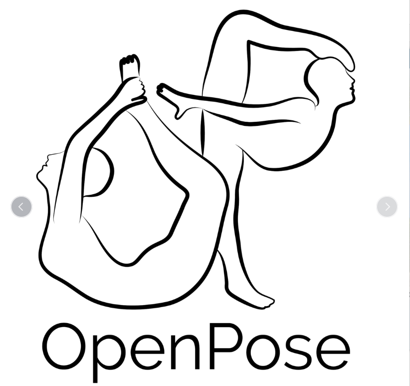
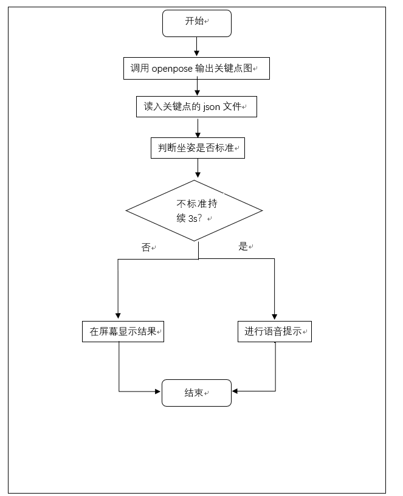

# standardSitting
> 基于卡内基梅隆大学的[Openpose开源项目](https://github.com/CMU-Perceptual-Computing-Lab/openpose)的坐姿检测与播报矫正软件
<p align="center">
    
</p>


项目采集了不同的坐姿图片，通过人工标注的形式定义标准坐姿和错误坐姿，同时标注错误姿势的要点，将错误坐姿定义为三类问题：头部不正，身体不直，腰背弯曲。

收集的数据进行归类后开始分析，通过身体部位节点计算，总结出几类问题置信度较高的参数。考虑到设备的问题和计算量，采用单目视觉摄像的方式，可以通过移动端和PC端进行设计，在学习的正前方放置摄像头。

通过openpose采集人体上身节点数据，经过分析后得到判断标准坐姿的参量，通过比较这些参量输出相应的显示，这里我们通过语音提示的方法来提示用户坐姿的错误，当用户姿势标准后停止错误提示。

<p align="center">
    
</p>

## Installation(**Windows Only**)
    download the latest release ver in [download page](https://github.com/GalliumWang/standardSitting/releases)
    and extract the app folder to anywhere of disk.


## Usage

Double click the poseestimation.exe in the root folder,then the initial period takes up abount ten seconds,when the label ```正在初始化``` turn to ```程序未运行```,click the ```开始检测``` botton to run the sitting posture detection.


for more information on the project,please go to [standardSitting doc](https://docs.google.com/document/d/1aBZUWWjfnGENfG-lLUxR1-8BpfNQt6iH_GTdcd2GyyI/edit?usp=sharing) and [standardSitting slides](https://docs.google.com/presentation/d/13BfF1TiJzeDX3NLtctPy5Vxs7LAVo-6Reb912g-ofNE/edit?usp=sharing).

## Release History

* v1.05
    ### 主界面图标更新
    ### 精简合并文件
  * 抽离源代码文件与其他不必要资源，发布供运行的程序版本
* v1.0
    ### 实现基本功能
    * 检测坐姿是否标准
    * 当检测到持续不标准坐姿时进行语音播报
    * 更换背景图片
    ### Issue
    * 必须点击“关闭程序”退出运行，否则直接关闭程序会导致json缓存遗留

## Meta
```人工智能```课程自主实验项目<br>
GPL-3.0 LICENSE.


## Contributing
1. Open new Issue or pull request to the master branch
2. For more help or info,please contact ```galliumwang199@gmail.com```

<!-- Markdown link & img dfn's -->
